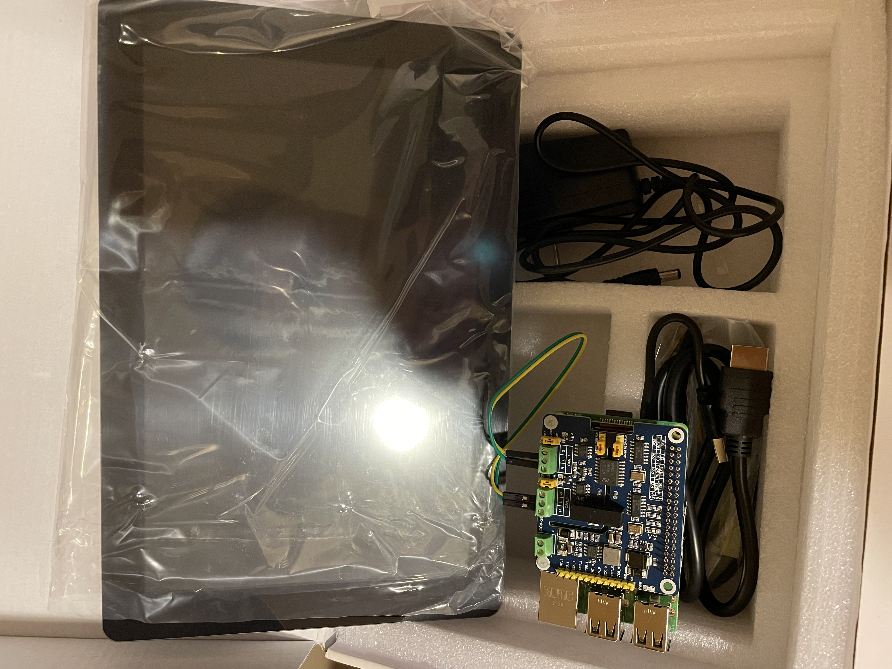
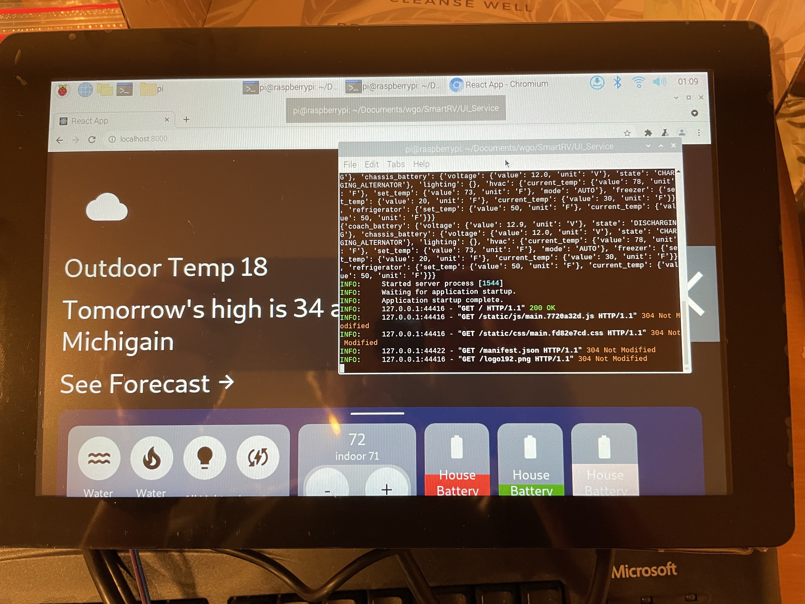

# Raspberry Pi Setup

# Prerequisites
- SD Card reader (Micro or Full size with adapter)

# HW Setup (as needed)
- Touchscreen
- CAN HAT
- Raspbeery Pi
- Keyboard

# Initial Image
- Download Raspberry Pi OS
https://www.raspberrypi.com/software/
- Flash image on SD card (Balena Etcher)
- Insert SD card into Raspberry Pi SD card slot
- Boot
- Go through wizard and connect to Wifi and set new password
- Enable SSH
    https://phoenixnap.com/kb/enable-ssh-raspberry-pi
- Install 7 Zip
    https://catonrug.blogspot.com/2014/06/raspberry-pi-7z-support.html

## Compile CAN HAT
Based on information here:
    https://www.waveshare.com/wiki/2-CH_CAN_FD_HAT

# Test Setup Overview

Version 1.0

## What's in the box
1. RaspberryPi3 B+
    - 1 GB RAM (same as HMI)
    - A53 Cortex (Similar to HMI)

2. Touchscreen 10" 1280x800
    - Powersupply
    - HDMI cable
    - USB cables

3. CAN HAT
    - 2 CAN channels, CAN-FD compatible
    Already mounted on Raspberry Pi and CAN1 wired to CAN0 for testing.
    With proper cable can be attached to the HMI to drive test cases etc.

4. SD Card 32 GB
    This has an image installed that has the basics, but more customization is needed to run the latest code

## You might need
- Additional Micro SD cards for experimentation
- A USB Keyboard (BT works as well after initial setup, which might be possible with on screen touched, did not test that)
- Wifi / LAN

## Installation
1. Find HDMI cable and connect between the touchscreen input and the Raspberry Pi output
2. Find Micro USB cable
    - Connect USB-A to the PCB on the back of the touchscreen
    - Connect the Micro USB connector to the Raspbeery Pi (on the side)
3. Carefully insert the USB cable that is attached to the screen into one of the 4 USB ports on the Raspberry Pi
4. Insert Micro SD Card in slot on RPi, bottom on the opposite side from the USB ports
5. Insert power supply into PCB on the touchscreen

RPi should boot

## Usage
Username: pi
Password: winnebago

Device should boot into a desktop, from which you can start a browser, terminals etc., touch should work out of the box and CAN drivers have been compiled and installed.

A quick test would be in a terminal

    cd ~/Documents/wgo
    sudo ./can_up.sh

    # This will bring up the CAN interfaces on 250K (RVC / J1939 speed)

    candump can0

Open another terminal and run

    cansend can1 123#01

You should see the following output on the initial terminal

     can0  123  [1]  01

This will effectively show that we can send a message to CAN1 and through a physical connect receive this on CAN0.

## Bring-up of the SmartRV SW
Best way TBD, a derivative docker-compose exists based on tobych-vagrant but needs more work, the quickest way to look at 'something' would be to go do the following:

    cd ~/.Documents/wgo/SmartRV/UI_Service
    poetry run python3 wgo_main_service.py

Once you see 'Application Startup Complete' you can open the browser (little world icon in the top bar), navigate to localhost:8000 and you should see a version of the UI.

